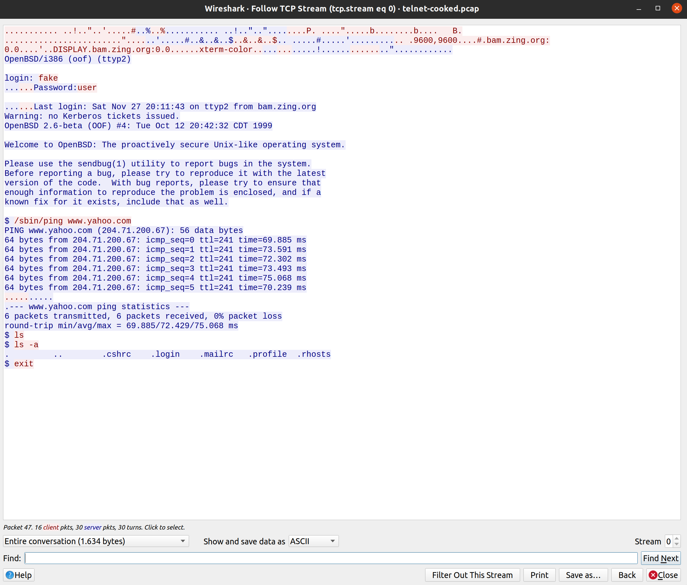
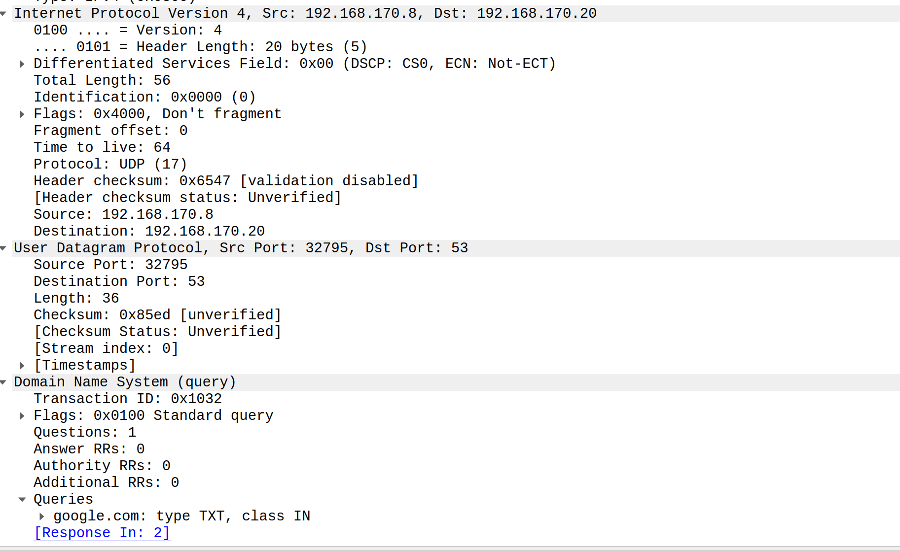
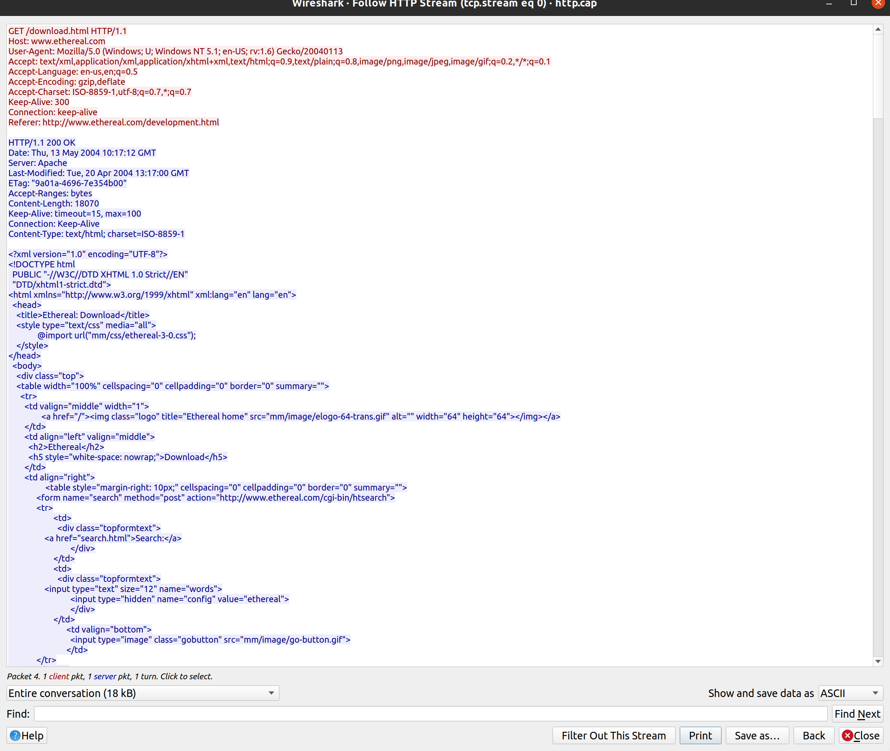

# ADMIN JARINGAN

### 1. [Analisis Telnet, DNS, dan HTTP](#main_analyze)

- [Analisis Telnet](#telnet_analyze)
- [Analisis DNS](#dns_analyze)
- [Analisis HTTP](#http_analyze)

### 2. [TCP Header](#tcp_header)

### 3. [UDP Header](#udp_header)

### 4. [IP Header](#ip_header)

## Analisis Telnet, DNS, dan HTTP

analisis disini menggunakan aplikasi wireshark dan wireshark capture yang bisa yang bisa anda download [disini](https://wiki.wireshark.org/SampleCaptures)

### 1. Analisis Telnet

Telnet adalah sebuah protokol jaringan yang digunakan untuk mengakses dan mengendalikan perangkat jarak jauh melalui jaringan. Biasanya, Telnet digunakan untuk mengakses shell atau lingkungan baris perintah pada perangkat jarak jauh seperti server, router, atau perangkat lainnya yang memiliki kemampuan koneksi jaringan.

Dalam penggunaannya, Telnet memungkinkan pengguna untuk terhubung ke perangkat jarak jauh dan berinteraksi dengan sistem tersebut seolah-olah mereka sedang duduk di depan perangkat itu sendiri. Pengguna dapat memasukkan perintah, menjalankan program, dan melihat output dari perangkat jarak jauh ini melalui koneksi Telnet.

#### Contoh Wireshark dari protokol jaringan telnet

        

#### Analisis

dari sini, kita bisa tau header, ip dari pengguna yaitu 192.168.0.2, dan ip server/pc yang di remote yaitu : 192.168.0.1. dan dari sini juga kita bisa tau port yang digunakan oleh client yaitu 1550 (protocol : UDP/TCP) dan juga server/pc yang di remote yaitu 23 (protocol : TCP | service : Telnet).

        

di aplikasi wireshark juga bisa melihat follow TCP atau apa yang terjadi pada pada protocol TCP. disini kita bisa lihat yang warna kemerahan itu adalah kiriman dari client (yang me-remote server/pc) dan yang biru adalah balasan dari server/pc yang di remote.

### 2. Analisis DNS

DNS adalah singkatan dari "Domain Name System" (Sistem Nama Domain). Ini adalah sistem yang digunakan dalam jaringan komputer untuk mengubah nama domain yang mudah diingat (seperti <www.contoh.com>) menjadi alamat IP numerik yang diperlukan oleh komputer untuk berkomunikasi satu sama lain di internet. DNS memungkinkan manusia untuk menggunakan nama domain yang mudah diingat saat mengakses situs web atau layanan online, sementara komputer menggunakan alamat IP untuk mengidentifikasi dan berkomunikasi dengan server yang tepat.

#### Contoh Wireshark dari DNS

        

#### Analisis

dari data di atas, kita bisa tau Internet protocol dari Client dan Protocol dari server yaitu : client = 192.168.170.8 & server = 192.168.170.20
dan ada port yang digunakan dari client dan server yaitu client : 32795 & server : 53

        

sama seperti telnet, pada analisis follow udp stream ada yang terjadi pada client (warna kemerahan) dan server (warna kebiruan).

### 3. Analisis HTTP

HTTP adalah singkatan dari "Hypertext Transfer Protocol" (Protokol Transfer Hiperteks). Ini adalah protokol yang digunakan untuk mengirimkan data antara klien (seperti peramban web) dan server di World Wide Web. HTTP digunakan untuk mengatur cara permintaan dan respon data, terutama dalam konteks halaman web, tetapi juga digunakan dalam berbagai aplikasi berbasis web.

HTTP beroperasi pada layer aplikasi dalam model referensi OSI (Open Systems Interconnection). Model OSI adalah kerangka kerja yang menggambarkan cara berinteraksi dan berkomunikasi antara berbagai komponen jaringan. Pada model OSI, HTTP berada pada Layer 7 atau Layer Aplikasi. Ini adalah lapisan tertinggi dalam model dan bertanggung jawab atas komunikasi antara aplikasi di kedua ujung koneksi jaringan.

#### Contoh Wireshark dari HTTP

        

#### Analisis

dari wireshark ini, kita bisa tau dari IP client dan juga server dan juga port yang digunakan sama seperti analisis sebelumnya.

IP client : 145.254.160.237

IP Server : 65.208.228.223

dan juga kita bisa tahu bahwa terjadi proses encoding dari image xml dan lain lainnya.

        

akan dikirimkannya header dari client (warna kemerahan) dan diterima oleh server(warna kebiruan) dan tanda jika berhasil ada tanda OK pada _HTTP/1.200 OK_ dan akan di tampilkan halaman dari webnya.

## TCP Header

        

Header TCP (Transmission Control Protocol) adalah bagian dari struktur data yang digunakan untuk mengemas dan mengirimkan data melalui koneksi TCP dalam jaringan komputer. TCP adalah protokol yang berorientasi pada koneksi dan dapat diandalkan, yang memastikan pengiriman data yang akurat, terurut, dan tanpa kerusakan antara pengirim dan penerima. Berikut adalah beberapa bidang utama yang ada dalam header TCP:

1. Port Sumber (Source Port): Ini adalah nomor port yang mengidentifikasi proses pengirim data di komputer pengirim.

2. Port Tujuan (Destination Port): Ini adalah nomor port yang mengidentifikasi proses penerima data di komputer penerima.

3. Nomor Sekuens (Sequence Number): Nomor ini mengidentifikasi urutan data dalam aliran. Setiap byte dalam aliran data memiliki nomor urut yang unik.

4. Nomor Konfirmasi (Acknowledgment Number): Nomor ini menunjukkan nomor urut dari byte berikutnya yang diharapkan diterima oleh pengirim. Ini digunakan dalam mekanisme pengakuan dan konfirmasi TCP.

5. Ukuran Header (Header Length): Ini menunjukkan panjang header TCP dalam kata (4-byte). Karena header TCP dapat mengandung opsi yang bervariasi dalam ukuran, nilai ini membantu untuk mengetahui di mana data aktual dimulai dalam segmen.

6. Flag Kontrol (Control Flags): Ini adalah serangkaian bit yang mengontrol perilaku koneksi TCP. Beberapa flag penting termasuk:

        URG (Urgent): Menandakan adanya data penting dalam segmen yang memerlukan penanganan segera.
        ACK (Acknowledgment): Menunjukkan bahwa nomor konfirmasi valid dalam segmen.
        PSH (Push): Meminta penerima untuk segera meneruskan data ke aplikasi penerima.
        RST (Reset): Digunakan untuk menghentikan koneksi secara tiba-tiba dan mengatur ulang koneksi.
        SYN (Synchronize): Menandakan permintaan koneksi atau inisialisasi koneksi.
        FIN (Finish): Menandakan bahwa pengirim telah selesai mengirim data dan ingin menutup koneksi.

7. Ukuran Jendela (Window Size): Ukuran jendela mengindikasikan berapa banyak data yang dapat diterima oleh penerima sebelum pengirim perlu menunggu pengakuan.

8. Checksum: Checksum adalah nilai yang dihitung dari header dan data TCP untuk mendeteksi kesalahan selama transmisi.

9. Pilihan (Options): Header TCP dapat mengandung opsi tambahan yang dapat digunakan untuk mengatur perilaku dan mengaktifkan fitur-fitur khusus, seperti penyesuaian ukuran jendela dan mekanisme pengiriman ulang yang lebih canggih.

10. Pointer Darurat (Urgent Pointer): Digunakan bersama dengan flag URG untuk menunjukkan posisi data yang mendesak dalam aliran.

Header TCP memainkan peran penting dalam mengatur komunikasi antara komputer pengirim dan penerima melalui koneksi TCP. Setiap bidang dalam header memiliki fungsi spesifik yang membantu memastikan pengiriman data yang akurat dan andal di seluruh jaringan.

## UDP Header

        

Header UDP (User Datagram Protocol) adalah bagian dari struktur data yang digunakan untuk mengemas dan mengirimkan data dalam koneksi UDP dalam jaringan komputer. UDP adalah protokol tanpa koneksi yang lebih sederhana daripada TCP, yang berarti tidak ada pengiriman ulang atau mekanisme pengakuan. Ini membuat UDP lebih cepat, tetapi juga lebih tidak andal dibandingkan dengan TCP. Berikut adalah beberapa bidang utama yang ada dalam header UDP:

1. Port Sumber (Source Port): Ini adalah nomor port yang mengidentifikasi proses pengirim data di komputer pengirim.

2. Port Tujuan (Destination Port): Ini adalah nomor port yang mengidentifikasi proses penerima data di komputer penerima.

3. Panjang UDP (Length): Panjang ini mencakup ukuran total dari header UDP dan data yang diikutsertakan dalam segmen UDP. Ini diukur dalam byte.

4. Checksum: Checksum digunakan untuk mendeteksi kesalahan pada data selama transmisi. Namun, dalam UDP, penggunaan checksum adalah opsional dan dapat diabaikan jika checksum diatur sebagai nol.

Header UDP cukup sederhana dan tidak mengandung banyak informasi tambahan seperti header TCP. Oleh karena itu, UDP lebih cepat dan memiliki overhead yang lebih rendah daripada TCP. Namun, karena kurangnya mekanisme pengiriman ulang dan pengakuan, UDP tidak cocok untuk aplikasi yang memerlukan pengiriman data yang andal, seperti transfer file atau streaming video. Sebaliknya, UDP lebih cocok untuk aplikasi yang lebih responsif dan dapat mengatasi kerugian data yang kecil, seperti aplikasi suara atau video real-time.

## IP Header

        

Header IP (Internet Protocol) adalah bagian dari struktur data yang digunakan untuk mengemas dan mengarahkan paket data dalam jaringan komputer. IP adalah protokol yang mendasari jaringan internet, dan bertanggung jawab untuk mengirimkan paket data dari sumber ke tujuan melalui jaringan yang mungkin terdiri dari beberapa perangkat dan rute. Berikut adalah beberapa bidang utama yang ada dalam header IP:

1. Versi (Version): Ini menunjukkan versi protokol IP yang digunakan. Dalam header IP, nilai ini dapat berupa 4 untuk IPv4 atau 6 untuk IPv6.

2. Panjang Header (Header Length): Panjang header IP diukur dalam kata (32-bit). Karena header IP dapat mengandung opsi yang bervariasi dalam ukuran, nilai ini membantu untuk mengetahui di mana data aktual dimulai dalam paket.

3. Tipe Layanan (Type of Service): Ini dulu digunakan untuk menandakan prioritas paket atau layanan yang diinginkan, tetapi sekarang lebih sering digunakan untuk mengindikasikan pengelompokan dan penanganan khusus oleh perangkat jaringan.

4. Panjang Total (Total Length): Ini adalah ukuran total paket IP, termasuk header dan data, diukur dalam byte.

5. Identifikasi (Identification): Nilai ini adalah nomor unik yang mengidentifikasi paket. Digunakan bersama dengan flag "Fragmentation" untuk mengatur ulang paket yang pecah-pecah.

6. Flag dan Fragment Offset: Digunakan dalam proses fragmentasi paket, yang memungkinkan paket besar untuk dipecah menjadi bagian yang lebih kecil saat melintasi jaringan dengan batasan ukuran maksimal. Flag ini mencakup "Don't Fragment" (DF) dan "More Fragments" (MF), sementara Fragment Offset menunjukkan posisi data dalam fragmen.

7. Time to Live (TTL): TTL menunjukkan berapa banyak langkah (hops) yang dapat dilakukan oleh paket sebelum dihapus dari jaringan. Ini membantu mencegah paket terperangkap dalam loop tak terbatas.

8. Protokol: Nilai ini menunjukkan protokol tingkat atas (seperti TCP, UDP, ICMP) yang akan menerima paket setelah tiba di tujuan.

9. Checksum: Checksum adalah nilai yang dihitung dari header IP untuk mendeteksi kesalahan pada header selama transmisi.

10. Alamat IP Sumber (Source IP Address): Ini adalah alamat IP yang mengidentifikasi pengirim paket.

11. Alamat IP Tujuan (Destination IP Address): Ini adalah alamat IP yang mengidentifikasi penerima paket.

Header IP membantu dalam pengemasan dan pengarahannya paket data melalui jaringan, memungkinkan mereka untuk mencapai tujuan dengan melalui perangkat-perangkat yang sesuai dan melalui rute yang benar. Ini merupakan komponen kunci dalam infrastruktur internet dan berperan dalam pengiriman data di seluruh jaringan global.
