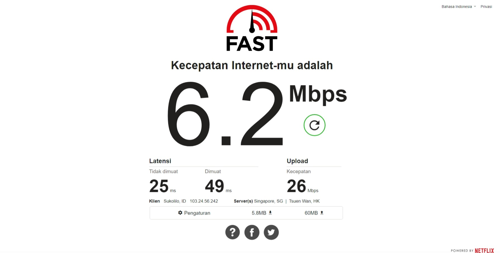
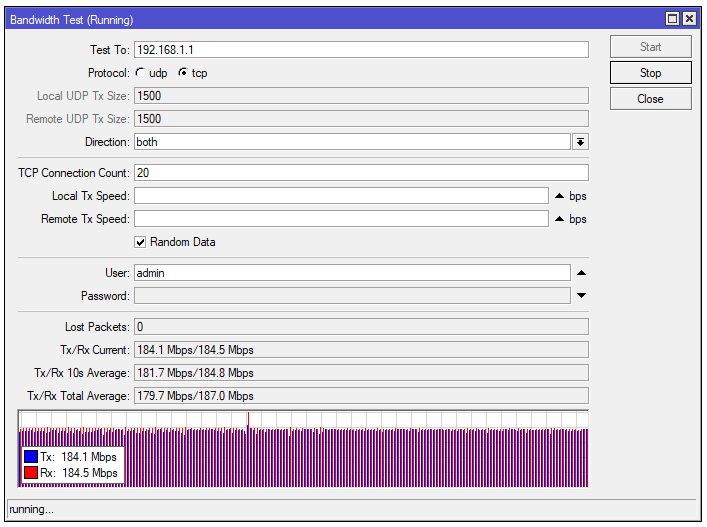

# Analisa Bandwidth Test

#### Menggunakan fast.com

dilakukan uji kecepatan internet menggunakan platform Fast.com. Uji ini bertujuan untuk mengukur kecepatan unduh (download), kecepatan unggah (upload), serta latensi koneksi dari lokasi Klien: Sukolilo, ID 103.24.56.242 ke Server: Singapore, SG Tsuen Wan, HK.  

- **Kecepatan Unduh (Download):** Kecepatan unduh yang terukur sebesar 6.2 Mbps menunjukkan tingkat kecepatan yang moderat. Hal ini mungkin dapat memengaruhi pengalaman pengguna dalam mengakses konten daring seperti streaming video atau unduhan file berukuran besar.  

- **Kecepatan Unggah (Upload):** Kecepatan unggah yang terukur sebesar 26 Mbps menunjukkan koneksi yang lebih cepat daripada kecepatan unduh. Ini dapat bermanfaat saat mengunggah berkas ke cloud atau melakukan aktivitas yang membutuhkan pengiriman data ke server.  

- **Latensi (Dimuat dan Tidak Dimuat):** Latensi tersebut menunjukkan hasil ukur waktu respons dari koneksi internet. Latensi yang tidak dimuat sebesar 25ms dan latensi dimuat sebesar 49ms. Latensi yang rendah memungkinkan respon yang lebih cepat saat mengakses situs web atau melakukan aktivitas daring lainnya.  

#### Menggunakan Winbox Bandwidth Test

Parameter yang digunakan pada test tersebut adalah:
- **Test To:** merupakan alamat yang akan dituju, pada test ini kami melakukan test ke 192.168.1.1 atau ip dari router kelompok 1.
- **Protocol:** kami menggunakan protokol TCP pada pengetesan ini.
- **Direction:** direction merupakan arah traffic. pada pengetesan tersebut kami memilih opsi both, yakni 2 arah upload dan download.
- **TCP Connection Count:** menggunakan default dari winbox, yakni 20.
- **Local dan Remote Tx Speed:** menggunakan opsi random dari default winbox.
- **User:** sebagai kredensial untuk autentikasi, diisi dengan value admin sesuai konfigurasi dari router.
- **Password**: sesuai konfigurasi router, password kosong.

Hasil dari bandwidth test:
- Terdapat 0 lost packet atau tidak ada packet yang hilang.
- Throughput jaringan pada saat capture diambil merupakan 184.1 Mbps untuk kecepatan transmisi (Tx), dan 184.5 untuk kecepatan receiving (Rx). angka ini bisa berfluktuasi tergantung pada performa jaringan, dll.
- Rerata throughput setiap 10 detik adalah 181.7 Mbps untuk kecepatan transmisi (Tx), dan 184.8 Mbps untuk kecepatan receiving (Rx).
- Rerata keseluruhan dari throughput pada saat pengetesan adalah 179.7 Mbps untuk kecepatan transmisi (Tx), dan 187.0 Mbps untuk kecepatan receiving (Rx).