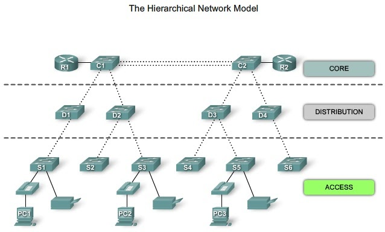

`Tugas ini merupakan tugas mata kuliah Konsep Jaringan yang dibimbing oleh Bpk. Dr. Ferry Astika Saputra, ST, M.Sc`

# Arsitektur Jaringan Pada Kampus

Arsitektur jaringan yang umum dipakai pada kampus atau institusi pendidikan tinggi salah satunya adalah Hierarchical Network. Arsitektur ini membagi jaringan menjadi tiga tingkatan: Core, Distribution, dan Access. Core menyediakan konektivitas antar area besar, Distribution mengelola lalu lintas antara core dan access, sedangkan Access menyediakan akses langsung ke pengguna.

Hierarchical Network Model adalah pendekatan dalam merancang jaringan yang membagi infrastruktur jaringan menjadi beberapa tingkatan atau lapisan. Pendekatan ini membantu dalam mengatur jaringan secara efisien dengan memisahkan fungsi-fungsi tertentu ke dalam lapisan-lapisan yang terpisah. Arsitektur ini umumnya terdiri dari tiga tingkatan utama: Core, Distribution, dan Access.

#### Layer Pada Hierarchical Network
1. **Core Layer:** Lapisan inti atau core layer adalah pusat dari jaringan. Fungsinya adalah untuk menyediakan koneksi cepat dan andal antar seluruh bagian dari jaringan. Di sini, biasanya terdapat perangkat keras yang kuat dan berkualitas tinggi seperti router atau switch kelas atas. Lapisan ini juga memiliki kapasitas tinggi dan meminimalisir latensi karena merupakan pusat utama lalu lintas data.

2. **Distribution Layer:** Lapisan distribusi berada di antara core dan access layer. Fungsinya adalah mengelola lalu lintas antara core dan access, menyediakan keamanan, kebijakan akses, dan melakukan segmentasi jaringan jika diperlukan. Di sini, biasanya terdapat perangkat seperti switch yang dapat mengatur lalu lintas data dengan cerdas dan efisien.

3. **Access Layer:** Lapisan akses adalah tempat di mana perangkat pengguna, seperti komputer, printer, atau perangkat IoT (Internet of Things), terhubung ke jaringan. Fungsinya adalah menyediakan akses ke jaringan inti dan memastikan pengguna memiliki konektivitas yang andal dan aman. Switch yang terletak di sini menghubungkan perangkat pengguna ke lapisan distribusi.

### Mengapa Hierarchical Network?
- **Skalabilitas:** Memungkinkan penambahan perangkat dan pengguna tanpa mengubah seluruh infrastruktur.
- **Manajemen yang Lebih Mudah:** Memisahkan fungsi-fungsi jaringan ke dalam lapisan membuat manajemen dan pemeliharaan lebih terorganisir.
- **Efisiensi:** Memisahkan lalu lintas data dan fungsi-fungsi jaringan ke dalam lapisan-lapisan terpisah dapat meningkatkan efisiensi dan kinerja jaringan secara keseluruhan.