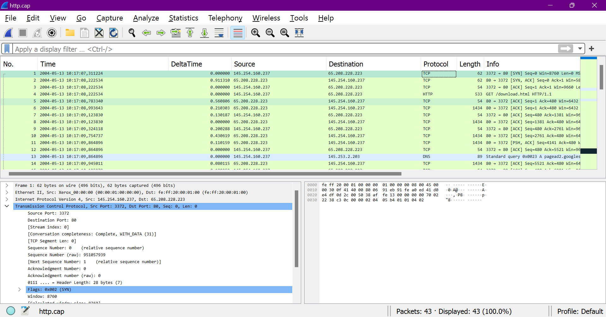
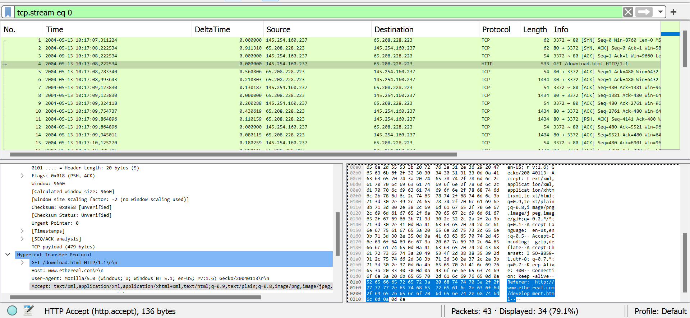
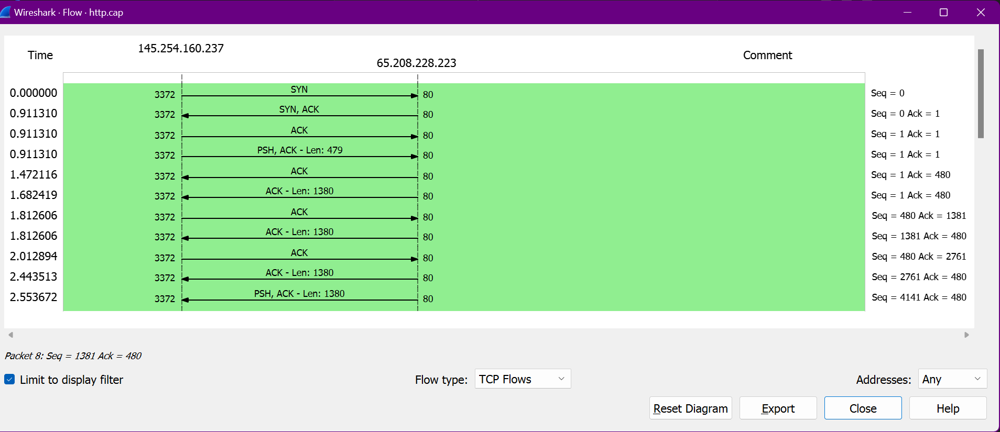
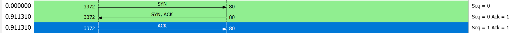
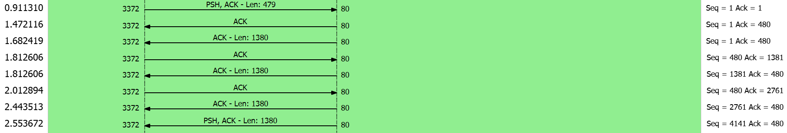
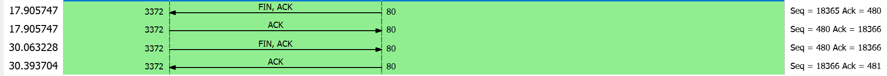
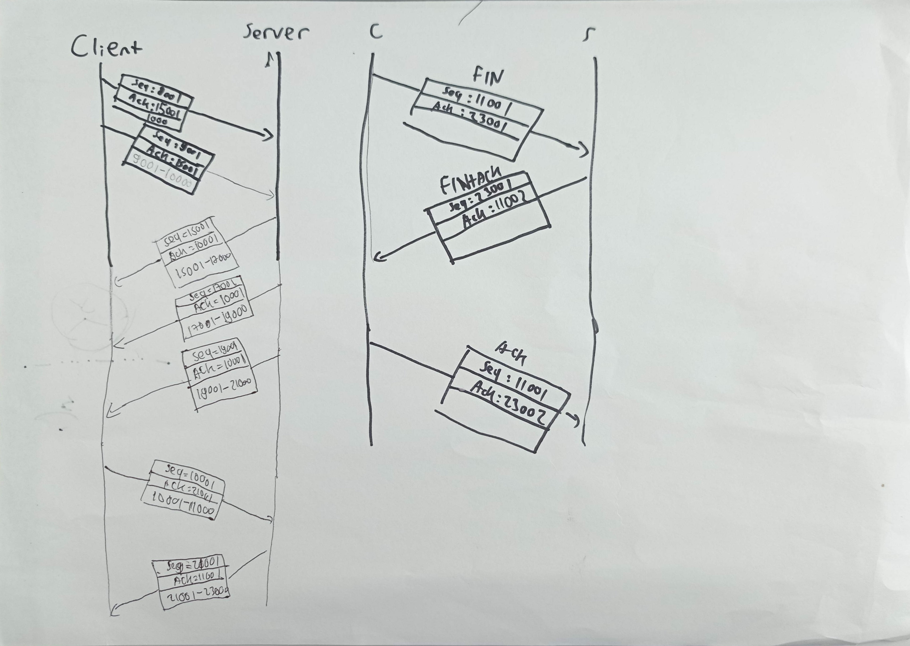
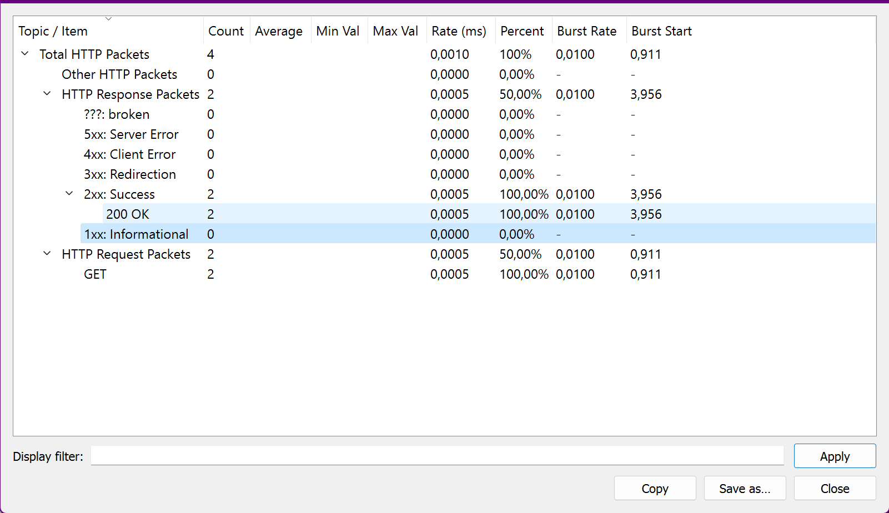
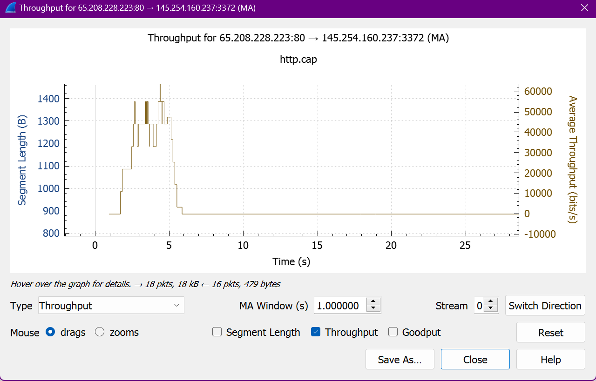

# TCP in HTTP

 _http.cap sample capture_

Dari 43 packet diatas, klik kanan>follow>tcp stream pada salah satu packet dengan protocol HTTP untuk memfilter packet yang berhubungan dengan HTTP.

 _filtered packet_

Wireshark akan secara otomatis memberi filter untuk menampilkan packet, sehingga terisa 34 packet dari 43.

## Flow Graph

 _Flow Graph_

```text
statistics>flow graph
check "Limit to display filter" for applying filter
change flow type to "TCP Flows" to focus only on TCP
```

FLow Graph Window berfungsi untuk menampilkan koneksi yang terjadi diantara kedua host(client/server). Disini ditampilkan berbagai informasi seperti packet time, arah koneksi, serta proses mulai dari connection establishment, data transfer hingga connection termination.

**1. Connection Establishment**
_Three way Handshake_

Tahap ini terjadi pada tiga packet awal. Berikut adalah rincian pada proses ini:

- Pada detik 0.0000, client mengirim segment SYN(Synchronize Sequence Number) kepada server dengan sequence number 0.
- Pada detik 0.9113, server merespon kepada client berupa segment SYN-ACK dengan sequence number 0 serta acknowledgment numbr 1 yang berarti menyetujui koneksi dari client serta memberi sinyal pada client untuk mengirim segment selanjutnya dengan seq number 1.
- Pada detik 0.9113, client merespon server berupa persetujuan(ACK) dengan seq number 1 sesuai sinyal dari server.

Setelah 3 tahap tersebut, koneksi client-server sudah terjalin.

**2. Data Transfer**
_Data Transfer Process_

Setelah koneksi terjalin, client dan server sudah dapat melakukan transfer data. Berikut adalah rincian dari proses transfer data:

- Pada detik 0.9113, client mengirim segment dengan panjang 479 bits serta membawa flag PSH yang berarti menginformasikan kepada penerima(server) untuk mengirimkan data kepada client. Selain itu, client juga mengirimkan ACK dengan value 1 yang menginformasikan kepada server untuk mengirimkan segment dengan seq number 1.

- Pada detik 1.4721, server mengirim 2 segment client dengan seq number 1. Segment ini berisi data sepanjang 1380 bits. Server juga mengirim ACK dengan value 480, yang berarti client akan mengirim dengan seq number 480 pada segment selanjutnya. Hal ini dikarenakan sebelumnya client telah mengirim segment dengan panjang 479 bits.

Proses data transfer ini akan terjadi terus menerus hingga salah satu host baik client atau server mengirim flag FIN untuk terminate connection. Banyak segment yang dikirimkan oleh client/server pada proes ini tergantung pada bandwith. Selain itu, panjang tiap segment juga bisa berubah selama proses data transfer.

**3. Connection Termination**
_Connection Termination Process_

Connection termination sendiri dimulai ketika salah satu host mengirimkan flag FIN yang berarti memutuskan koneksi. Proses termination ini berakhir ketika host lain juga mengirim FIN, sehingga kedua host sama-sama terputus. Berikut adalah rincian dari proses ini:

- Pada detik 17.9057, server mengirim flag FIN dengan seq 18365 dan ACK 480 yang berarti server memulai proses terminasi ini dan mengharapkan segment selanjutnya dikirim dengan seq 480.

- Pada detik 17.9057, client merespon berupa acknowledgment dengan tujuan menginformasikan kepada server jika FIN sudah diterima. Selanjutnya, FIN juga akan dikirimkan oleh client.

- Pada detik 30.0632, client juga mengirimkan FIN dengan seq 480 sesuai ack dari server serta menginformasikan pada server jika client juga melakukan terminasi koneksi.

- Pada detik 30.3937, server merespon berupa acknowledgment dengan tujuan menginformasikan kepada client jika FIN sudah diterima.

## Ilustrasi Data Transfer



## Packet Counter

_Packet Counter_

```text
choose one HTTP packet
statistics>HTTP>Packet Counter
```

Packet counter dapat kita gunakan untuk melihat banyaknya request-response antar client-server. Dari gambar diatas, terlihat terdapat total 4 HTTP Packets yang terdiri dari 2 request dan 2 response. Kita juga dapat melihat request method seperti GET, POST, PUT, PATCH, DELETE, dll. Selain itu, kita juga dapat melihat response status dari server seperti 2xx(Success), 4xx(Client Error), 5xx(Server Error), dll.

## Throughput

_Throughput_

```text
choose one HTTP packet
statistics>TCP Stream Graphs>Throughput
```

TCP Throughput adalah ukuran seberapa efektif data dapat ditransmisikan melalui koneksi TCP dalam suatu periode waktu tertentu. Ini mencerminkan jumlah data yang berhasil dikirim atau diterima melalui koneksi TCP dalam satuan data per waktu, seperti byte per detik atau bit per detik.

Dari gambar diatas, kita dapat melihat grafik throughput yang menggambarkan bagaimana throughput berubah selama sesi koneksi. Grafik throughput ini memungkinkan kita untuk memantau perubahan dalam kecepatan transmisi data selama waktu tertentu. Ini sangat berguna untuk mengidentifikasi puncak throughput, penurunan kinerja, atau tren dalam koneksi jaringan.

- Puncak pada grafik mengindikasikan titik-titik di mana throughput mencapai nilai tertinggi.
- Penurunan tajam atau fluktuasi throughput dapat mengindikasikan masalah dalam koneksi jaringan, seperti packet loss atau konflik.

Melalui grafik throughput ini, kita dapat dengan cepat mengidentifikasi tren dan perubahan dalam kinerja koneksi TCP. Ini bisa membantu kita dalam mengatasi masalah jaringan, memantau kinerja aplikasi, atau melakukan analisis lebih lanjut terhadap sesi koneksi yang spesifik.
