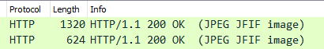
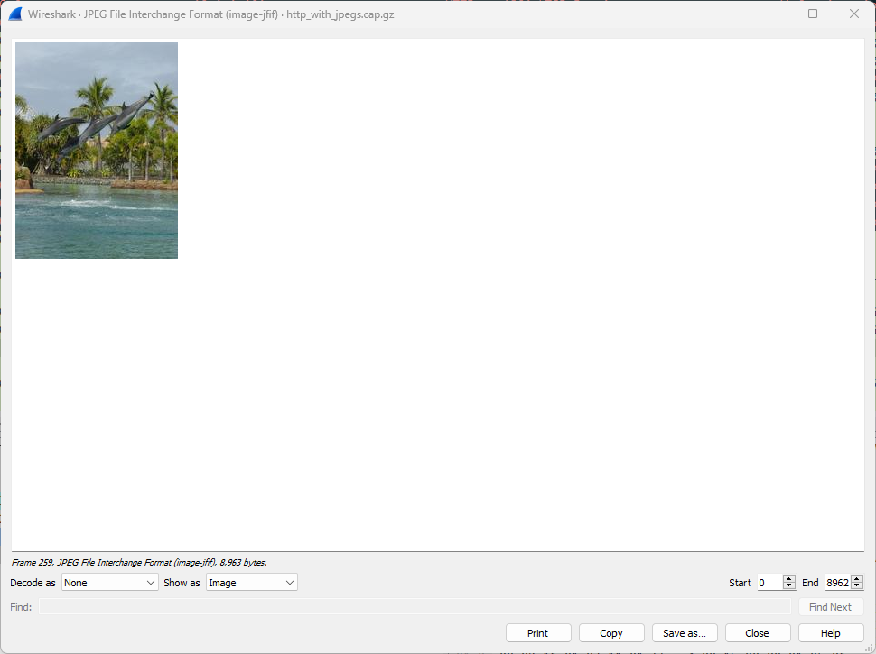

# Mengakses Packet Gambar Pada HTTP

1. Buka file sample capture http_with_jpegs.cap menggunakan Wireshark, pastikan filter capture HTTP  

2. Cari packet dengan info **200 OK (JPEG JFIF image)**  

3. Klik packet tersebut, lalu klik kanan pada **JPEG File Interchange Format** yang terletak pada window di kiri bawah. Kemudian pilih menu **Show Packet Bytes..** atau bisa dengan menekan **CTRL + SHIFT + O**  

4. Maka Wireshark akan otomatis menampilkan data gambar dari packet tersebut. Berikut adalah contoh gambar yang terdapat pada packet nomor 61.  

---

Terdapat total 5 packet dengan data gambar pada file capture tersebut. Berikut adalah 4 packet tersisa yang terdapat data gambar:

 
<i>Packet No. 72</i>

 

 
<i>Packet No. 259</i>

 

 
<i>Packet No. 269</i>

 

 
<i>Packet No. 479</i>

