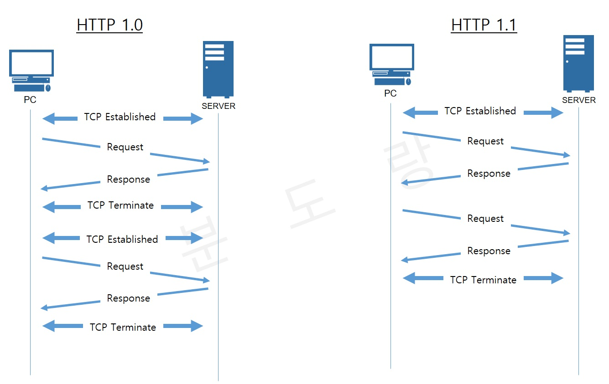
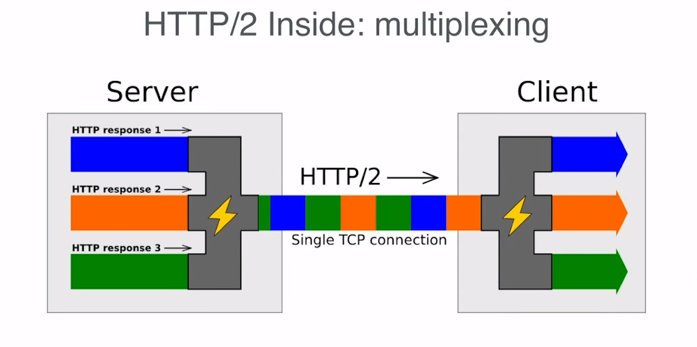

# Evolusi HTTP

#### :bulb: HTTP/0.9
Merupakan versi pertama dari protokol HTTP yang mengadopsi model request-response di mana klien memulai koneksi melalui jabat tangan TCP dan mengirimkan data untuk direspon oleh server.

Berikut adalah beberapa fitur penting dari HTTP/0.9:

- Setiap request dari klien melibatkan pembuatan koneksi baru dengan 3-way TCP handshake dengan server. Antarmukanya terutama berdasarkan telnet. Request klien adalah satu baris yang terdiri dari karakter ASCII yang dibatasi oleh carriage return, dan hanya request GET yang didukung dengan format GET http://{host}:{port}.
- Respon hanya terdiri dari dokumen HTML. Koneksi ditutup segera setelah setiap respons.
- Header request dan respons tidak didukung. Ini berarti bahwa tidak mungkin untuk membedakan antara respons yang berhasil dan respons yang gagal.

#### :bulb: HTTP/1.0

HTTP/1.0 adalah perkembangan dari HTTP/0.9. HTTP/1.0 juga beroperasi dengan model request-response seperti HTTP/0.9.

Berikut adalah beberapa fitur penting dari HTTP/1.0:

- Setiap request dari klien melibatkan pembuatan koneksi baru dengan 3-way TCP handshake dengan server. Antarmukanya berkembang dari yang berbasis telnet menjadi berbasis browser.
- Penggunaan header dalam request dan respons dengan dukungan untuk versi HTTP dan kode status; Dukungan untuk metode HTTP POST, GET, dan HEAD.
- Dukungan untuk Content-Type yang kaya dalam header respons yang memungkinkan respons non-HTML untuk dikembalikan. Koneksi masih ditutup setelah setiap respons, seperti pada HTTP/0.9.
- HTTP/0.9 dan HTTP/1.0 memerlukan 3-way TCP handshake untuk setiap request karena koneksi ditutup setelah respons. Hal ini memperkenalkan latensi yang signifikan pada setiap request.

#### :bulb: HTTP/1.1

HTTP/1.1 merupakan kemajuan terpenting dalam protokol HTTP yang memperkenalkan beberapa optimasi dan fitur penting.

HTTP/1.1 memperkenalkan dukungan untuk metode **POST, GET, PUT, DELETE, TRACE, OPTIONS.**
Selain itu HTTP/1.1 menghadirkan beberapa improvement:

- Sebuah koneksi yang dapat direuse.
- Penambahan pipelining yang memungkinkan request kedua untuk dikirimkan sebelum respons dari request pertama sepenuhnya dikirim. 
- Dukungan chunked response.
- Mekanisme kontrol cache yang diperbarui.
- Negosiasi konten, termasuk pada bahasa, encoding, dan type. Client dan server sekarang dapat melakukan semacam perjanjian mengenai data mana yang akan ditukarkan.
- Kemampuan hosting domain yang berbeda pada IP yang sama.

#### :bulb: HTTP/2.0
Untuk mengatasi aplikasi web yang semakin kompleks seiring berjalannya waktu, Google melakukan eksperimen menggunakan protokol SPDY pada awal 2010. Protokol SPDY memiliki responsifitas dan dapat mengatasi masalah duplikasi pada transmisi data. Sehingga protokol inilah yang menjadi inspirasi utama dikembangkannya HTTP/2.0

Beberapa improvement pada HTTP/2.0:
- Bukan lagi protokol basis teks, melainkan **basis biner**. Meskipun tidak dapat dibuat dan dibaca secara manual, hal ini memungkinkan optimasi yang lebih baik.
- **Multiplexed protocol**. Request paralel dapat dibuat pada koneksi yang sama, yang mana tidak dapat dilakukan oleh HTTP/1.x

- **Compressed header**. Memperbaiki masalah duplikasi dan overhead data yang ditransmisikan.
- **Mekanisme Server Push** yang memungkinkan server untuk mengisi data pada client cache.

#### :bulb: Pasca HTTP/2.0
Beberapa ekstensi pada HTTP yang terjadi pada tahun 2016:

- **Client Hints** yang memnungkinkan browser atau client untuk mengkomunikasikan informasi mengenai requirements dan batasan hardware kepada server.
- Penambahan **Security-Related Cookie Prefixes** pada header yang membantu untuk menjamin secure cookie tidak dapat diedit.