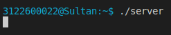
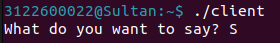
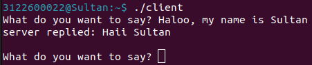
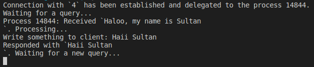
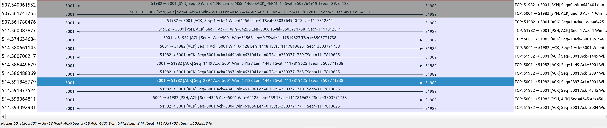
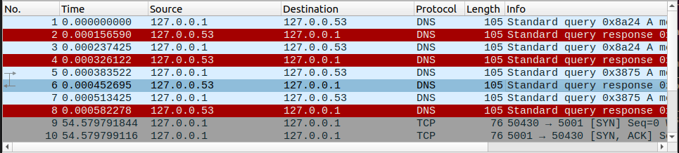
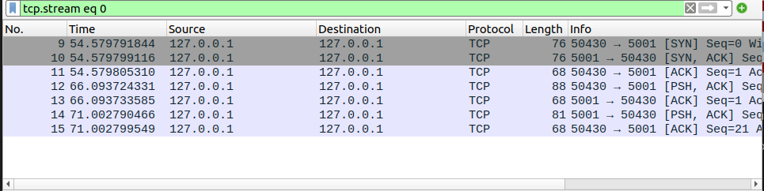
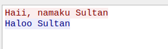

# SOCKET PROGRAMMING

Socket programming adalah cara menghubungkan dua node pada jaringan untuk berkomunikasi satu sama lain. Satu socket (node) me-listen port tertentu pada IP, sementara socket yang lain menjangkau yang lain untuk membentuk koneksi. Server membentuk socket listener sementara klien menjangkau server.

## Socket programming menggunakan c

### Source code

```text
server: https://gist.github.com/sultanasf/2f50111a88359c96b5b4420828f1ce83
client: https://gist.github.com/sultanasf/777f5e07a2a96bb0d219c509f13cd781
```

### Mengedit server

Dari kode diatas, tambahkan kode pada function process_operation, agar server dapat merespon client melalui input pada CLI

```c
char *process_operation(char *input)
{
    //tambahan untuk input
    char text[256];
    printf("\nWrite something to client: ");
    fgets(text, 256, stdin);

    size_t n = strlen(text) * sizeof(char);
    char *output = malloc(n);
    memcpy(output, text, n);/*salin array text ke array copy*/
    return output;
}
```

Sesuaikan juga variabel port_number sesuai dengan port yang tersedia (tidak dipakai proses lain).

```c
const uint16_t port_number = 5001;
```

### Mengedit client

Dari kode diatas, ubahlah scanf() pada infinite while-loop menjadi fgets() agar input bisa dipisahkan spasi.

```c
    printf("What do you want to say? ");
    bzero(buffer, 256);
    // scanf("%s", buffer);
    fgets(buffer, sizeof(buffer), stdin);
```

Ubah juga variabel server agar sesuai dengan IP Address dimana server dijalankan. Untuk case ini, saya gunakan localhost ("127.0.0.1").

```c
    server = gethostbyname("127.0.0.1");
```

### Compile & Run

Jalankan perintah "make" pada terminal. Perintah ini akan secara otomatis menjalankan dua perintah untuk meng-compile file server.c dan client.c

```bash
all:
 gcc -o server server.c
 gcc -o client client.c
```

Setelah berhasil compile, jalankan server pada terminal



Buka terminal baru, lalu jalankan client



Inputkan pesan pada client, lalu respon pesan tersebut melalui server





### Analisis

- __Server__:
Membuat server sederhana menggunakan socket yang bisa meng-handle banyak client. Server ini melakukan listen/mengamati pada port tertentu (dalam kasus ini port 5001) dan mengalihkan koneksi klien yang masuk ke child process untuk ditangani. Server ini merespons permintaan klien dan memiliki mekanisme timeout untuk menutup koneksi yang idle terlalu lama.

- __Client__:
Berkomunikasi dengan server melalui socket. Kode ini menghubungkan klien ke server yang berjalan di alamat IP yang sudah kita tentukan (pada kasus ini 127.0.0.1 atau localhost) pada port 5001.

### Percobaan (mengirim char 'n' sebanyak n kali)

```c
while (1) {
    int n;
    printf("How many n do you want to input? ");
    scanf("%d", &n);

    bzero(buffer,n);
    for(int i=0; i<n; i++){
        buffer[i] = 'a';
    }
    buffer[n] = '\0';
    
    n = write(sockfd,buffer,strlen(buffer));
    if (n < 0){
        perror("ERROR while writing to socket");
        exit(1);
    }
    bzero(buffer,n);

    n = read(sockfd, buffer, n);
    if (n < 0){
        perror("ERROR while reading from socket");
        exit(1);
    }

    printf("server replied: %s \n", buffer);
    // escape this loop, if the server sends message "quit"
    if (!bcmp(buffer, "quit", 4))
        break;
}
```

Ini adalah loop utama program, di mana program akan berinteraksi dengan server. Program pertama-tama meminta pengguna untuk memasukkan jumlah karakter yang akan dikirim ke server.

Kemudian, program mengisi buffer dengan karakter 'a' sebanyak yang diminta oleh pengguna. Data dalam buffer dikirim ke server menggunakan write, dan program menerima respons dari server menggunakan read.

Jika terjadi kesalahan dalam penulisan atau pembacaan data, pesan kesalahan dicetak, dan program keluar.Program mencetak respons dari server dan memeriksa apakah respons tersebut adalah "quit". Jika ya, program akan keluar dari loop utama, mengakhiri komunikasi dengan server.

- Percobaan 1
Dalam percobaan ini saya mencoba untuk mengirim pesan string 'n' dengan panjang 5000. Pesan tersebut diterima server lalu dikirimkan lagi ke client dengan sukses. namun dari sisi server

Yang dilakukan oleh client :

disini client ke server akan mengirim sebanyak n yang kita inputkan, disini menginputkan 5000.


melihat wireshark disisi client, client -> server akan mengirim langsung 5000.namun di sisi server -> client akan mengirim dibagi segment segment yaitu 1448, 1448, 1448, 659.

## Capture Wireshark


Lakukan capture pada wireshark untuk menangkap TCP protocol.


Follow salah satu TCP Stream

Dari Kedua gambar diatas, dapat kita ketahui bahwa 3 segment pertama adalah tahap connection establishment dan segment selanjutnya menggunakan flag PSH yang menyatakan pengiriman data yang berupa string.


