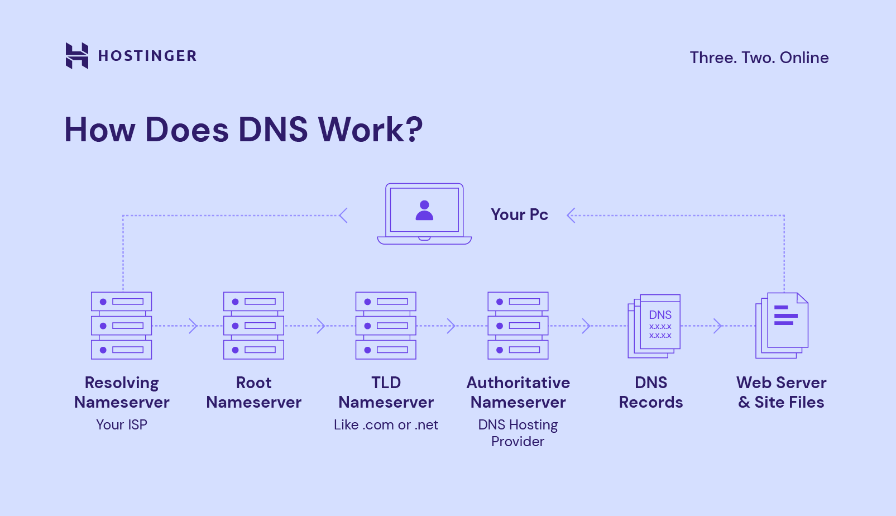

# DNS (Domain Name System)

#### :bulb: Apa Itu DNS?
Domain Name System atau DNS adalah sistem yang menerjemahkan nama domain menjadi IP address agar bisa dipahami oleh komputer saat kita mengakses sebuah website menggunakan nama domain. 

Bisa dibilang DNS adalah ‘penerjemah’ yang memungkinkan kita berkomunikasi dengan komputer ketika akan mengunjungi sebuah website. Sebab, komputer mengakses website menggunakan IP address, sedangkan kita pasti kesulitan menghafal semua angka tersebut.

Fungsi DNS yaitu seperti aplikasi ‘Kontak’ di smartphone yang menampilkan nama untuk setiap nomor telepon yang tersimpan. Nah, DNS mengubah nama domain menjadi angka-angka yang bisa dipahami komputer agar bisa menampilkan website yang kita buka.

Mau tahu lebih lanjut? Yuk baca sampai selesai, karena kami membahas selengkapnya tentang pengertian DNS beserta cara kerjanya, fungsi DNS, serta macam-macam record yang ada. Selamat membaca!

#### :bulb: Cara Kerja DNS
Jadi, DNS bekerja dalam beberapa langkah menggunakan proses yang disebut DNS lookup atau resolution. Untuk bisa menjalankan fungsinya

berikut adalah ringkasan alur cara kerja DNS:

- **Permintaan dari Pengguna**: Pengguna memasukkan nama domain (seperti www.contoh.com) ke browser mereka. 

- **Cari dalam Cache Lokal**: Browser pertama-tama memeriksa cache lokal untuk melihat apakah alamat IP untuk nama domain tersebut sudah disimpan sebelumnya. Jika iya, maka proses selesai di sini dan situs web akan dimuat. 

- **Permintaan ke Server DNS Lokal**: Jika tidak ada informasi dalam cache, browser akan mengirimkan permintaan ke server DNS lokal yang dikonfigurasi oleh penyedia layanan internet (ISP). Server DNS lokal ini dikenal sebagai resolver. 

- **Pemeriksaan Cache Resolver**: Resolver akan memeriksa apakah alamat IP untuk nama domain tersebut ada di dalam cache-nya. Jika ada, maka resolver akan mengembalikan alamat IP ke browser. 

- **Tanya Server DNS Root**: Jika informasi tidak ada di cache resolver, resolver akan mengirimkan permintaan ke server DNS root. Server DNS root memberikan informasi awal tentang di mana server DNS terkait dengan domain tingkat teratas (TLD) dapat ditemukan. 

- **Tanya Server DNS TLD**: Server DNS root memberi tahu resolver tentang server DNS untuk domain tingkat teratas (seperti .com, .org, .net, dll.). Resolver kemudian mengirimkan permintaan ke server DNS TLD yang sesuai. 

- **Tanya Server DNS Otoritatif**: Server DNS TLD memberikan informasi tentang server DNS otoritatif untuk domain yang diminta (misalnya, contoh.com). Resolver kemudian mengirimkan permintaan ke server DNS otoritatif tersebut. 

- **Mendapatkan Alamat IP**: Server DNS otoritatif memberikan alamat IP terkait dengan nama domain yang diminta kepada resolver. 

- **Cache Hasil**: Resolver menyimpan informasi ini dalam cache-nya untuk penggunaan mendatang, mempercepat akses di masa depan. 

- **Mengirimkan Alamat IP ke Browser**: Resolver mengirimkan alamat IP ke browser pengguna. 

- **Pemuatan Situs Web**: Browser menggunakan alamat IP yang diterima untuk menghubungi server yang meng-host situs web yang diminta. 

- **Tampilan Situs Web**: Akhirnya, situs web dimuat dan ditampilkan di browser pengguna. 