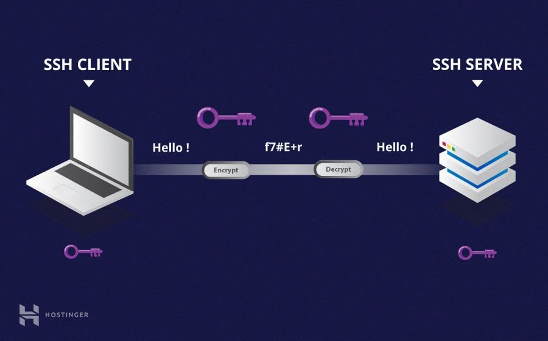

# SSH (Secure Socket Shell) Protocol

#### :bulb: Apa Itu SSH?
SSH, atau Secure Shell, adalah sebuah protokol jaringan yang digunakan untuk mengamankan komunikasi antara dua sistem komputer. Protokol ini diciptakan untuk menggantikan protokol telnet dan rsh (remote shell), yang tidak aman karena mengirimkan data dalam format teks. 

#### :bulb: Karakteristik SSH
Protokol SSH memiliki beberapa karakteristik kunci yang membuatnya menjadi pilihan utama untuk mengamankan koneksi jaringan. Berikut adalah beberapa karakteristik utama dari protokol SSH:

- **Enkripsi**: Salah satu karakteristik paling penting dari SSH adalah kemampuannya untuk menyediakan enkripsi yang kuat. Ini berarti data yang dikirimkan antara dua sistem dienkripsi dan tidak dapat dengan mudah dibaca oleh pihak yang tidak sah. 

- **Otentikasi yang Aman**: SSH memastikan bahwa pihak yang mencoba mengakses sistem adalah pihak yang seharusnya dengan menggunakan mekanisme otentikasi yang kuat. Ini dapat mencakup penggunaan nama pengguna dan kata sandi atau penggunaan kunci publik/privat. 

- **Kunci Publik dan Privat**: SSH menggunakan pasangan kunci publik dan privat untuk otentikasi dan enkripsi. Kunci publik dapat dibagikan secara terbuka, sementara kunci privat harus dijaga dengan sangat rahasia. Kunci ini bekerja bersama untuk memastikan keamanan komunikasi. 

- **Portabilitas**: SSH dapat digunakan di berbagai sistem operasi dan platform. Ini memungkinkan komunikasi yang aman antara sistem yang berbeda, termasuk antara sistem Windows dan sistem Unix/Linux. 

- **Fleksibilitas**: SSH memiliki banyak fitur dan kemampuan yang memungkinkannya untuk digunakan dalam berbagai skenario. Misalnya, SSH mendukung pembuatan tunnel untuk mengamankan koneksi di dalam jaringan yang tidak terpercaya, forwarding untuk mengalihkan koneksi melalui koneksi SSH, dan banyak lagi. 

- **Manajemen Kunci yang Kuat**: SSH memungkinkan pengelolaan kunci yang kuat. Ini termasuk kemampuan untuk mengenerate, mengelola, dan memutar kunci secara teratur untuk meminimalkan risiko keamanan. 

- **Pemantauan dan Logging**: SSH memiliki kemampuan untuk mencatat aktivitas otentikasi dan koneksi. Hal ini memungkinkan administrator untuk memantau dan menganalisis aktivitas yang terjadi pada sistem. 

- **Resisten terhadap Serangan**: SSH dirancang dengan mempertimbangkan berbagai jenis serangan, termasuk serangan brute-force terhadap kata sandi, serangan sniffing, dan serangan lainnya. Dengan menggunakan teknik enkripsi dan otentikasi yang kuat, SSH dapat memberikan tingkat perlindungan yang tinggi. 

- **Tidak Berbasis Teks**: Berbeda dengan protokol seperti Telnet, SSH tidak mengirimkan data dalam teks terbuka, yang membuatnya jauh lebih aman. Informasi sensitif seperti kata sandi tidak dapat dengan mudah diintersep dan dibaca oleh pihak yang tidak sah. 

Dengan karakteristik-karakteristik ini, SSH telah menjadi standar industri untuk mengamankan koneksi jaringan dan mengakses sistem dari jarak jauh secara aman.

#### :bulb: RFC-4251
RFC 4251 adalah dokumen spesifikasi yang mendefinisikan arsitektur dasar dari protokol SSH (Secure Shell). Berikut adalah ringkasan dari RFC 4251:

- **Judul**: RFC 4251 berjudul "The Secure Shell (SSH) Protocol Architecture". 

- **Tujuan**: Dokumen ini bertujuan untuk memberikan panduan arsitektural yang mendasar bagi pengembangan protokol SSH. 

- **Arsitektur Protokol**: RFC 4251 memberikan gambaran umum tentang struktur dan alur protokol SSH. Ini mencakup komponen-komponen seperti koneksi, sesi, pesan, dan protokol otentikasi. 

- **Struktur Pesan**: Dokumen ini mendefinisikan struktur dan format dari pesan-pesan yang dikirimkan antara client dan server dalam protokol SSH. Ini mencakup informasi seperti tipe pesan, panjang pesan, dan data pesan. 

- **Data dan Format Byte**: RFC 4251 memberikan spesifikasi terkait pengiriman data dalam bentuk byte, termasuk aturan encoding dan decoding. 

- **Referensi Algoritma Kriptografi**: Dokumen ini menyebutkan bahwa algoritma kriptografi harus mematuhi RFC 4253, yang mendefinisikan spesifikasi dari protokol SSH versi 2. 

- **Otentikasi**: RFC 4251 memberikan panduan singkat tentang proses otentikasi dalam protokol SSH. 

- **Referensi Lain**: Dokumen ini mengacu pada RFC terkait lainnya yang membentuk bagian dari ekosistem protokol SSH. 

Penting untuk dicatat bahwa RFC 4251 membentuk dasar bagi spesifikasi selanjutnya dalam keluarga protokol SSH, termasuk versi 2 dari protokol SSH yang dijelaskan dalam RFC 4253. Dokumen ini menyediakan kerangka dasar untuk implementasi dan pengembangan protokol SSH yang aman.