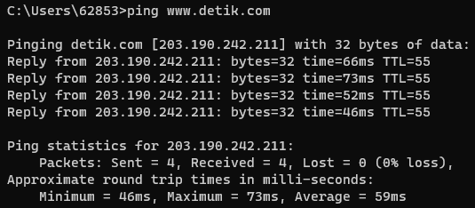
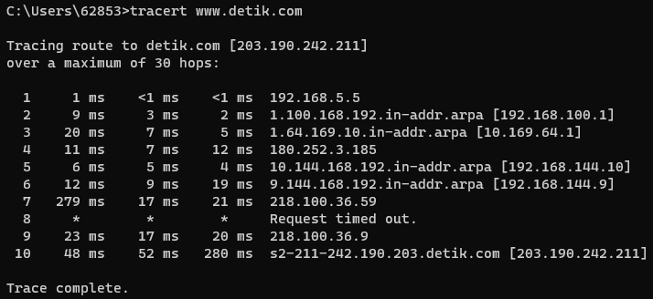

# Ping dan Tracert

#### :bulb: Apa Itu Ping?
Ping merupakan singkatan dari **Packet Internet Network Groper**. Secara sederhana, ping adalah perintah untuk mengecek status dan keberadaan host dalam sebuah jaringan internet. Sebagai contoh, client bisa menggunakan ping untuk mengecek apakah server dari website yang client akses berjalan baik. Ketika melakukan ping, client akan mendapatkan hasil sesuai dengan respon dari host tujuan.

#### :memo: Analisis Ping
**Host yang Dituju**: Ini adalah alamat IP atau nama domain dari host yang sedang diuji. Perintah ping akan mengirimkan pesan ICMP Echo Request ke host ini untuk mengukur respons.<br>

**Paket Dikirim (Sent)**: Jumlah total paket ICMP Echo Request yang dikirimkan ke host. Jumlah ini ditentukan oleh pengguna saat menjalankan perintah ping.<br>

**Paket Diterima (Received)**: Jumlah total paket ICMP Echo Reply yang diterima dari host. Jika host merespons dengan sukses, maka jumlah ini akan sama dengan jumlah paket yang dikirim. Jika terjadi kegagalan koneksi, jumlah ini akan kurang dari jumlah paket yang dikirim.<br>

**Persentase Kehilangan (Loss)**: Persentase paket yang hilang selama uji ping. Ini dihitung dengan membagi jumlah paket yang hilang dengan jumlah total paket yang dikirim, kemudian dikalikan 100. Misalnya, jika 10 dari 100 paket hilang, persentase kehilangan adalah 10%.<br>

**Waktu Respons Minimum (Min)**: Waktu tercepat dalam milidetik (ms) yang dibutuhkan untuk paket kembali dari host.<br>

**Waktu Respons Maksimum (Max)**: Waktu terlama dalam milidetik (ms) yang dibutuhkan untuk paket kembali dari host.<br>

**Waktu Respons Rata-rata (Avg)**: Rata-rata waktu dalam milidetik (ms) yang dibutuhkan untuk paket kembali dari host.<br>

#### :memo: Output Ping www.detik.com
Berikut output dari ```ping www.detik.com``` <br>

 <br>

**Pinging detik.com [203.190.242.211] with 32 bytes of data**: Ini adalah awalan dari perintah ping. Mengindikasikan bahwa komputer sedang mencoba untuk melakukan ping ke detik.com dengan alamat IP 203.190.242.211 menggunakan paket data sebesar 32 byte.<br>

**Reply from 203.190.242.211**: bytes=32 time=66ms TTL=55: Ini adalah hasil dari ping pertama:<br>

- **Reply from 203.190.242.211**: Menunjukkan bahwa paket data telah berhasil mencapai detik.com dan mendapatkan respons dari alamat IP 203.190.242.211.<br>

- **bytes=32**: Menunjukkan bahwa ukuran paket data yang dikirim adalah 32 byte.<br>

- **time=66ms**: Menunjukkan bahwa waktu yang dibutuhkan untuk perjalanan bolak-balik (round trip) dari komputer Anda ke detik.com dan kembali adalah 66 milidetik (ms).<br>

- **TTL=55: Menunjukkan "Time To Live" (TTL)**, yaitu jumlah hop maksimum yang diperbolehkan sebelum paket dianggap hilang atau dihapus. TTL akan berkurang setiap kali paket melalui router. Di sini, TTL adalah 55.<br>

**Ping statistics for 203.190.242.211**:
- Packets: Sent = 4, Received = 4, Lost = 0 (0% loss): Menunjukkan statistik ping. Komputer telah mengirim 4 paket, semuanya diterima tanpa satu pun yang hilang, sehingga tidak ada kehilangan paket (0% loss).<br>

**Approximate round trip times in milli-seconds**:

- **Minimum = 46ms**: Waktu minimum yang diperlukan untuk perjalanan bolak-balik adalah 46 milidetik.<br>

- **Maximum = 73ms**: Waktu maksimum yang diperlukan untuk perjalanan bolak-balik adalah 73 milidetik.<br>

- **Average = 59ms**: Rata-rata waktu yang diperlukan untuk perjalanan bolak-balik adalah 59 milidetik.<br>

#### :bulb: Apa Itu Tracert?
Traceroute atau tracert adalah network diagnostic tool yang digunakan untuk melacak setiap rute jaringan yang dilalui oleh IP address secara real-time.

Sederhananya, jika sedang mengunjungi suatu website, data yang didapatkan dari website tersebut tentunya harus melintasi beberapa perangkat dan jaringan di sepanjang jalan, terutama router. Traceroute melacak bagaimana data di internet bergerak dari sumbernya ke tujuannya.

Selama melacak perjalanan jaringan, tracert juga mampu mengetahui kesalahan atau kegagalan yang terjadi selama proses pertukaran data berlangsung. Di situlah tracert berperan sebagai alat diagnosa jaringan. Sehingga dapat menunjukkan di mana lokasi yang menyebabkan koneksi internet kamu bermasalah.

#### :memo: Analisis Tracert

Output dari perintah tracert akan memberikan informasi tentang setiap hop atau titik antara komputer dan tujuan akhir. Berikut adalah penjelasan setiap kolom pada output dari perintah tracert:<br>

**Hop**: Ini adalah nomor hop dalam perjalanan dari komputer Anda menuju tujuan. Hop pertama adalah komputer Anda sendiri, sedangkan hop terakhir adalah tujuan akhir.<br>

**RTT1, RTT2, RTT3**: Singkatan dari Round-Trip Time. Ini adalah waktu yang diperlukan untuk paket data untuk pergi dari komputer Anda ke hop tertentu dan kembali. Di sebagian besar kasus, Anda akan melihat tiga angka RTT. Ini adalah tiga kali percobaan untuk mengukur waktu perjalanan.<br>

**Alamat IP**: Ini adalah alamat IP dari hop tersebut. Ini bisa berupa alamat IP internal atau eksternal, tergantung pada konfigurasi jaringan.<br>

**Nama host (jika ada)**: Ini adalah nama yang terkait dengan alamat IP hop tersebut, jika informasi DNS tersedia.<br>

####:memo: Output Tracert www.detik.com

Berikut adalah contoh output ```tracert www.detik.com``` <br>
 <br>

Hasil dari perintah tracert di atas adalah sebuah laporan dari perjalanan paket data menuju tujuan yaitu detik.com. Mari kita coba analisis:<br>

**Tracing route to detik.com [203.190.242.211]**: Ini adalah baris header yang memberikan informasi tujuan tracert, yaitu detik.com, bersama dengan alamat IP tujuan.<br>

**Over a maximum of 30 hops**: Ini memberi tahu bahwa tracert akan melakukan pencarian hingga maksimal 30 langkah (hops) untuk mencapai tujuan. Hops adalah rute atau titik antara komputer Anda dan tujuan akhir.<br>

**1 ms <1 ms <1 ms 192.168.5.5**: Ini adalah hasil dari hop pertama:<br>

- **Hop pertama (1)**: Waktu yang dibutuhkan untuk mengirim paket ke 192.168.5.5 adalah kurang dari 1 ms.<br>

- **Hop kedua (2)**: Waktu yang dibutuhkan untuk mengirim paket ke 192.168.5.5 adalah kurang dari 1 ms.<br>

- **Hop ketiga (3)**: Waktu yang dibutuhkan untuk mengirim paket ke 192.168.5.5 adalah kurang dari 1 ms.<br>

- **Alamat IP: 192.168.5.5** adalah alamat IP hop pertama. Hal ini menunjukkan bahwa hop pertama adalah router atau perangkat dalam jaringan lokal Anda<br>.

**9 ms 3 ms 2 ms 1.100.168.192.in-addr.arpa [192.168.100.1]**: Ini adalah hasil dari hop kedua:<br>

- **Hop pertama (1)**: Waktu yang dibutuhkan untuk mengirim paket ke 192.168.100.1 adalah 9 ms.<br>

- **Hop kedua (2)**: Waktu yang dibutuhkan untuk mengirim paket ke 192.168.100.1 adalah 3 ms.<br>

- **Hop ketiga (3)**: Waktu yang dibutuhkan untuk mengirim paket ke 192.168.100.1 adalah 2 ms.<br>

- **Alamat IP: 192.168.100.1** adalah alamat IP hop kedua. Ini menunjukkan bahwa hop kedua adalah router atau perangkat dalam jaringan lokal Anda.<br>

**20 ms 7 ms 5 ms 1.64.169.10.in-addr.arpa [10.169.64.1]**: Ini adalah hasil dari hop ketiga:<br>

- **Hop pertama (1)**: Waktu yang dibutuhkan untuk mengirim paket ke 10.169.64.1 adalah 20 ms.<br>

- **Hop kedua (2)**: Waktu yang dibutuhkan untuk mengirim paket ke 10.169.64.1 adalah 7 ms.<br>

- **Hop ketiga (3)**: Waktu yang dibutuhkan untuk mengirim paket ke 10.169.64.1 adalah 5 ms.<br>

- **Alamat IP: 10.169.64.1** adalah alamat IP hop ketiga. Ini menunjukkan bahwa hop ketiga adalah router atau perangkat dalam jaringan lokal Anda.<br>

...dan seterusnya.<br>

Penting untuk dicatat bahwa waktu diukur dalam milidetik (ms) dan hasilnya dapat berbeda pada setiap hop karena lalu lintas jaringan dan keadaan jaringan yang berbeda. Juga, jika ada baris yang mencantumkan "Request timed out.", itu berarti paket tidak mendapatkan respons dari hop tersebut dalam batas waktu yang ditentuk.<br>

Hop terakhir menunjukkan detik.com, yang diidentifikasi dengan alamat IP 203.190.242.211. Ini adalah tujuan akhir dari rute yang diambil oleh paket data.<br>