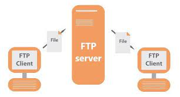
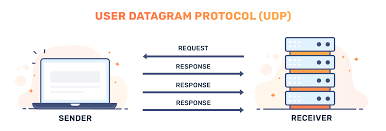

# File Transfer Protocol

FTP atau File Transfer Protocol merupakan protokol yang bertugas untuk menjembatani pertukaran informasi di dalam suatu komputer melalui suatu jaringan.

Sebenarnya, File Transfer Protocol (FTP) secara umumnya lebih sering menggunakan Transmission Control Protocol (TCP) sebagai protokol transportasinya, bukan User Datagram Protocol (UDP). Berikut adalah penjelasan mengenai keduanya:

**TCP (Transmission Control Protocol):**

FTP umumnya menggunakan TCP sebagai protokol transportasinya. TCP adalah protokol yang handal dan mengatur koneksi yang stabil antara pengirim dan penerima data.
TCP memastikan bahwa data dikirim dalam urutan yang benar, tanpa hilang, dan tanpa duplikasi. Jika ada data yang hilang atau rusak selama transfer, TCP akan memastikan data tersebut dikirim ulang.
Koneksi TCP memiliki mekanisme tiga langkah tangan (three-way handshake) untuk menginisiasi koneksi dan juga memiliki mekanisme pengaturan aliran (flow control) yang membantu menghindari kelebihan beban jaringan.

**UDP (User Datagram Protocol):**

UDP adalah protokol yang tidak andal dan tanpa koneksi. Ini berarti data dikirim dalam bentuk datagram tanpa perlu membangun koneksi terlebih dahulu.
UDP lebih cepat daripada TCP karena tidak ada overhead yang terkait dengan pengaturan dan pemeliharaan koneksi.
Namun, karena sifatnya yang tidak andal, UDP tidak memiliki mekanisme otomatis untuk memastikan bahwa data dikirim atau diterima dengan benar. Data bisa hilang atau tiba dalam urutan yang salah tanpa pemberitahuan.
Dalam konteks FTP, TCP digunakan karena transfer file yang handal dan akurat lebih penting daripada kecepatan. Dengan menggunakan TCP, FTP dapat memastikan bahwa semua file yang ditransfer tiba dengan baik dan dalam urutan yang benar.

Namun, dalam beberapa kasus, terutama ketika efisiensi dan kecepatan lebih diutamakan daripada keandalan mutlak, ada varian FTP yang menggunakan UDP sebagai protokol transportasinya. Namun, metode ini biasanya tidak umum dan lebih sering digunakan dalam skenario khusus yang mengharuskan transfer cepat tetapi mungkin dengan risiko data yang hilang atau rusak
