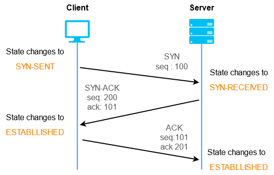

# Three Way Handshake

Three-Way Handshake adalah suatu proses yang digunakan dalam protokol TCP (Transmission Control Protocol) untuk memastikan bahwa komunikasi antara dua perangkat (misalnya, komputer dan server) dapat dimulai dengan lancar dan dapat diandalkan. Proses ini terjadi pada awal pembentukan koneksi antara kedua perangkat tersebut. Tujuan utama TWH adalah untuk menginisialisasi parameter koneksi yang diperlukan untuk mengatur aliran data antara perangkat-perangkat tersebut.

Berikut adalah langkah-langkah dalam Three-Way Handshake:

**Step 1: SYN (Synchronize)**

``
Perangkat yang akan memulai koneksi (biasanya disebut sebagai "client") mengirimkan sebuah paket khusus yang disebut "SYN" (Synchronize) ke perangkat tujuan (biasanya disebut sebagai "server").
Paket SYN ini berisi nomor urut (sequence number) awal yang akan digunakan oleh client dalam mengirimkan data. Nomor ini digunakan untuk mengidentifikasi urutan data yang dikirim.
Paket SYN ini juga mengandung nilai "ISN" (Initial Sequence Number), yang merupakan nomor acak yang digenerate oleh client.
``

**Step 2: SYN-ACK (Synchronize-Acknowledge)**

``
Setelah server menerima paket SYN dari client, server akan merespon dengan mengirimkan paket "SYN-ACK" kembali ke client.
Paket SYN-ACK ini mengandung nomor urut yang dihasilkan oleh server untuk mengidentifikasi urutan data dari server ke client.
Server juga mengonfirmasi nomor urut yang diterima dari client (nilai ISN+1), menunjukkan bahwa server telah menerima permintaan koneksi dari client.
``

**Step 3: ACK (Acknowledge)**
``
Setelah client menerima paket SYN-ACK dari server, client akan mengirimkan sebuah paket "ACK" (Acknowledge) ke server sebagai konfirmasi bahwa paket SYN-ACK telah diterima.
Paket ACK ini juga mengandung nomor urut yang dihasilkan oleh client untuk mengidentifikasi urutan data dari client ke server.
Proses ini menunjukkan bahwa koneksi telah berhasil diinisialisasi dan keduanya siap untuk saling bertukar data.
Setelah Three-Way Handshake selesai, koneksi TCP antara client dan server sudah terbentuk dengan parameter-parameter yang telah diinisialisasi. Selanjutnya, data dapat diandalkan untuk dikirimkan dalam urutan yang benar antara kedua perangkat tersebut.
``

*Dalam singkatnya, Three-Way Handshake adalah langkah awal penting dalam pembentukan koneksi TCP yang memastikan keduanya siap untuk mengirim dan menerima data secara andal.*
